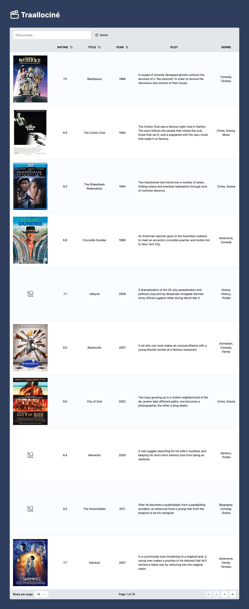
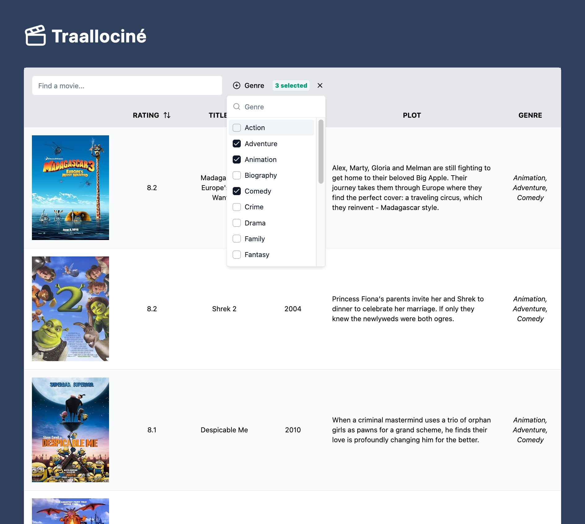

<h1 align="center">🎬Tablociné 🎬</h1>
<h3 align="center">React - TypeScript</h3>

<p align="center">
    Sustainable alternative to IMDB.<br/><br/>
    <a href="https://tablocine-table.vercel.app/">:computer: Live Demo :eyes:</a><br/><br/>
</p>

<!-- TABLE OF CONTENTS -->

## Table of Contents

- [About the Project](#about-the-project)
    - [Principal Features](#principal-features)
    - [Built With](#built-with)
- [Getting Started](#getting-started)
    - [Prerequisites](#prerequisites)
    - [Installation](#installation)
- [License](#license)
- [Contact](#contact)

<!-- ABOUT THE PROJECT -->

## About the Project

Front-End exercise .

<!-- PRINCIPAL FEATURES -->

#### Principal Features

- **Movie Search**: Allows users to search for movies by title.
- **Sorting**: Users can sort movies by title, rating, and year of release.
- **Filtering**: Provides filtering options for movies based on genre.
- **Accessibility**: Designed with accessibility best practices to ensure the application is usable by everyone.
- **Responsive Design**: Fully responsive layout that adapts to different screen sizes and devices.


<!-- BUILT WITH -->

#### Built With

- **[React](https://reactjs.org/)**: A JavaScript library for building user interfaces.
- **[TypeScript](https://www.typescriptlang.org/)**: A typed superset of JavaScript.
- **[Tailwind CSS](https://tailwindcss.com/)**: A utility-first CSS framework.
- **[Shadcn UI](https://ui.shadcn.com/)**: A component library built with React and Tailwind CSS.
- **[React Query](https://tanstack.com/query/v4)**: A library for fetching and caching server data in React.
- **[React Table](https://tanstack.com/table/v8)**: A library for building tables and data grids in React.


<!-- GETTING STARTED -->

## Getting Started

#### Prerequisites

- Node.js
- NPM - Node Package Manager

#### Installation

1 - Clone the Project's repository

```sh
git clone git@github.com:Banaanas/tablocine-front-exercice.git
```

2 - Install NPM Packages / Dependencies

```sh
npm clone install
```

3 - Development Server

```sh
npm run start
```

4 - Production build

```sh
npm run build
```

## Screenshots


<p align="center">
  <a href="https://tablocine-table.vercel.app">
    
  </a>
</p>


<p align="center">
  <a href="https://tablocine-table.vercel.app">
    
  </a>
</p>
